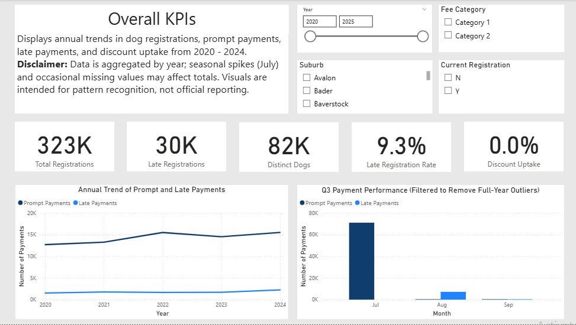
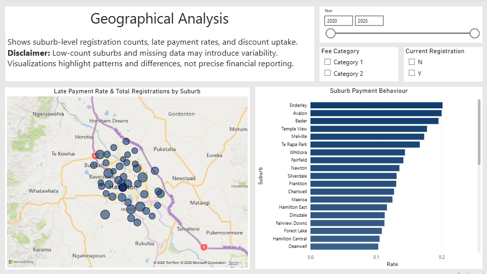
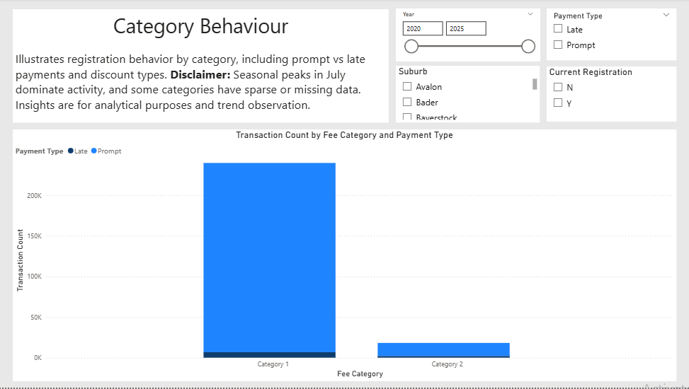
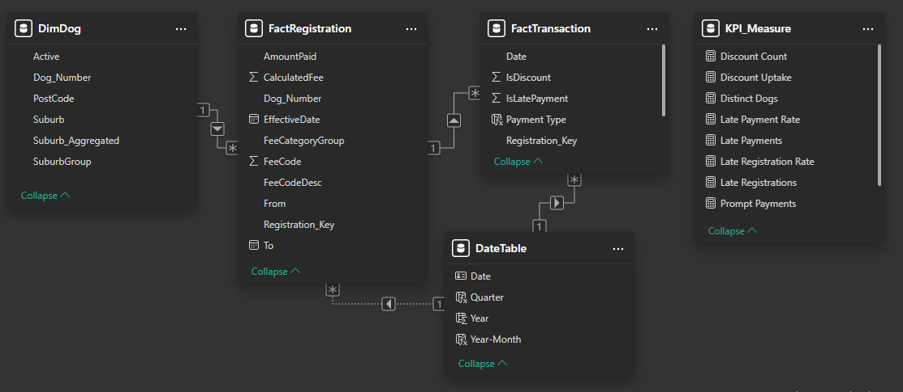

# Dog Registration Compliance & Incentives Analysis

**Author:** Gabriel Wu  
**Date:** 15 March 2026  
**Project Type:** End-to-End Data Analytics Case Study  
**Data Source:** Hamilton City Council – Waikato Open Data Co-Lab (All datasets are licensed under the Creative Commons Attribution 4.0 New Zealand License.)

---

## Overview
This project analyses dog registration data (2020–2024) from Hamilton City Council to understand:  

- Registration behaviour and seasonal trends  
- Late payment patterns  
- Uptake of council discount programs  

Interactive dashboards and SQL analysis were used to highlight trends, support operational planning, and inform targeted communication strategies.  
> **Disclaimer:** This project is a portfolio case study for demonstration purposes. 
> The analysis uses publicly available Hamilton City Council data and is not official work conducted for the Council.

---
## Dashboard Highlights

This section summarises key insights from the Power BI dashboard. Screenshots are included for quick reference.

### 1. Overview KPIs
Displays total registrations, late registration counts, discount uptake percentages, and key trends at a glance.  

### 2. Geographical Analysis
Highlights suburbs with higher late payment rates and discount uptake, supporting targeted outreach.  

### 3. Category Behaviour
Visualises registration compliance by owner category, showing differences between compliant and default owners.  

### 4. Star Schema Data Model
Illustrates how dog registration and transaction data are structured in Power BI for efficient analysis.  

---

## Key Insights
- **Seasonal Peaks:** Most dog registrations occur in July. Late payment penalties increase shortly after.  
- **Suburb Variation:** High late-payment areas include Enderley, Bader, and Melville. Low late-payment areas include Huntington, Te Rapa, and Harrowfield.  
- **Discount Program Uptake:** Participation in fencing, neutering, obedience, and permanent ID incentives varies widely by suburb.  
- **Population Impact:** High-population suburbs (Nawton, Frankton, Hamilton East) have the greatest influence on overall compliance.  
- **Data Quality:** Around 12–13% of records are missing payment or effective date information; monitoring is recommended.  

---

## Recommendations
1. **Pre-Registration Reminders:** Launch campaigns in June to encourage early compliance.  
2. **Targeted Outreach:** Focus communication on suburbs with higher late-payment rates.  
3. **Promote Incentives:** Increase awareness of available discount programs.  
4. **Prioritise High-Population Suburbs:** Target areas with the largest dog populations for maximum impact.  
5. **Monitor Data Quality:** Regularly review registration and transaction records to ensure accurate reporting.  

---

## Data Overview
The analysis uses three primary datasets:  

| Dataset | Records | Purpose |
|---------|--------|---------|
| DimDog | 82,149 | Dog demographics and location |
| FactRegistration | 323,196 | Registration and fee details |
| FactTransaction | 1,550,635 | Payment and discount transactions |

Key metrics include registration counts, late payment rates, discount uptake, and geographic trends.  

---

## Repository Contents
- `eda_queries.sql` – Exploratory SQL queries  
- `data_cleaning.sql` – Data cleaning scripts  
- `dog_registration.pbix` – Power BI dashboard  
- `dog_registration_analysis_report.pdf` – Full analysis and findings  
- `images/` – Screenshots of dashboard visualisations  

---

## How to Use
1. Open the Power BI `.pbix` file to explore interactive dashboards.  
2. Run SQL scripts in SQL Server to replicate data preparation and analysis*.  
3. Reference visualisations and insights to inform compliance, communication, and policy decisions.
*Note: Raw datasets from Waikato Open Data Co-Lab are used. Running the SQL scripts demonstrates the end-to-end workflow from raw data to analytical insights.*  

---

## References
- [Hamilton City Council – Renew a Dog Registration](https://hamilton.govt.nz/do-it-online/pay-it/renew-a-dog-registration)  
- [Waikato Open Data Co-Lab – Dog Dataset](https://data-waikatolass.opendata.arcgis.com/datasets/hcc::dog/about)  
- [Waikato Open Data Co-Lab – Dog Registration Dataset](https://data-waikatolass.opendata.arcgis.com/datasets/hcc::dog-registration/about)  
- [Waikato Open Data Co-Lab – Dog Transaction Dataset](https://data-waikatolass.opendata.arcgis.com/datasets/hcc::dog-transaction/about)  
